# 📧 AutoU — Classificador Inteligente de E-mails

<div align="center">


**Desafio Técnico — Desenvolvedor Python/AI**
Sistema que **classifica e responde** e-mails corporativos (Produtivo × Improdutivo) com **AI**, UX moderna e **deploy em nuvem**.

🔗 **[Acesse em produção](https://autou-email-classifier-xuy3.onrender.com/)**

[🎯 Contexto](#toc-contexto) •
[📊 Critérios](#toc-criterios) •
[🖼️ Demo](#toc-demo) •
[⚡ Quickstart](#toc-quickstart) •
[🏗️ Arquitetura](#toc-arquitetura) •
[🔐 Segurança](#toc-seguranca) •
[📡 API](#toc-api) •
[🧪 Testes](#toc-testes) •
[🚀 Deploy](#toc-deploy) •
[🛣️ Contribuições](#toc-roadmap) •
[📄 Licença](#toc-licenca) •
[👥 Autor](#toc-autor) •
</div>

---
<a id="toc-contexto"></a>
## 📌 Contexto do Desafio

Empresas do setor financeiro recebem **milhares de e-mails por dia**. Parte desses e-mails exige ação imediata (ex.: solicitações de suporte, status de casos em aberto), enquanto outros são improdutivos (ex.: felicitações, mensagens irrelevantes).

O objetivo do desafio técnico é desenvolver uma **aplicação web** capaz de:

1. **Classificar automaticamente** os e-mails em duas categorias:
   - **Produtivo** → requer ação ou resposta específica.
   - **Improdutivo** → não requer ação imediata.

2. **Sugerir respostas automáticas** adequadas à categoria identificada.

Além disso, foi solicitado que a solução tivesse:
- Uma **interface web intuitiva** (upload de TXT/PDF ou texto manual).
- **Backend em Python** com técnicas de NLP e integração com API de AI.
- **Deploy em nuvem** para acesso público e teste pela equipe avaliadora.

## 🎯 Como a Solução Atende (e Supera) os Requisitos

Minha implementação do **AutoU Email Classifier** entrega uma aplicação **robusta, moderna e pronta para avaliação**:

- ✅ **Classificação Automática com IA**
  - Integração real com **OpenAI** (chat completions) via `httpx` e prompts otimizados.
  - **Confidence score** calculado a partir de sinais do texto e da resposta da IA.
  - Recuperação de erros com **fallback heurístico** (não há dependência direta de terceiros para o plano B).

- ✅ **Respostas Automáticas Contextuais**
  - Geração de resposta a partir da IA, com **tons**: `formal`, `neutro` e `amigavel`.
  - **Refinamento de resposta** (re-escrita no tom solicitado).

- ✅ **Resiliência e Disponibilidade**
  - **Fallback heurístico** quando a IA falha (timeout/401/429, etc.).
  - Heurística ponderada (termos de alto/médio/baixo peso), **bônus por tamanho de texto** e tratamento de mensagens curtas.

- ✅ **Interface Web Premium**
  - Upload de **PDF/TXT** + entrada de texto livre.
  - UI responsiva (Tailwind + Alpine.js), **dark/light mode** e feedback em tempo real.

- ✅ **Qualidade Técnica**
  - **Clean Architecture** (camadas: web, services, core, utils).
  - **Testes automatizados** com Pytest (252 testes, 87% coverage).
  - **API REST documentada** via **OpenAPI/Swagger**.
  - **Proteção JWT** em endpoints sensíveis (classificação e resposta).
  - **CI/CD** com GitHub Actions + **Docker** multi-stage.

- ✅ **Hospedagem em Nuvem**
  - Deploy em produção com HTTPS/SSL automático
  - Health check e logging estruturado


> ℹ️ Observação: o código tem stubs para `HF` (Hugging Face) como **possibilidade futura de integração**, porém **não há uso de `transformers`** no ambiente atual — quando `provider="HF"`, a implementação retorna o **fallback heurístico**.
<a id="toc-demo"></a>
## 🖼️ Demo

<p align="center">
  
</p>

**O que o GIF mostra (roteiro de 15–25s):**
1. Acesso à página inicial.
2. **Upload** de um `.pdf` ou `.txt` (ou colar texto).
3. Clique em **Classificar** → exibição do resultado: **Produtivo/Improdutivo** + justificativa.
4. Geração de **resposta automática** (trocar tom: formal/neutro/amigável).
5. **Dashboard** com métricas (tempo de resposta, % de produtivos, etc.).

### Screenshots
<p align="center">
  
  
</p>
<p align="center">
  
  
</p>

<a id="toc-como-funciona"></a>
## 🔄 Como Funciona

**Pipeline de classificação:**
1. **Entrada**: texto ou upload de arquivo (.pdf/.txt)
2. **Pré-processamento**: limpeza e normalização (spaCy/NLTK)
3. **Classificação**: OpenAI com fallback heurístico em caso de erro
4. **Resposta**: geração automática com 3 tons disponíveis
5. **Exibição**: resultado + resposta + métricas

**Fallback heurístico** usa pontuação ponderada:
- **Termos produtivos**: `suporte`, `erro`, `problema`, `urgente`, `fatura`, `login` (3 pontos)
- **Termos médios**: `dúvida`, `solicitação`, `configuração` (2 pontos)
- **Termos leves**: `ajuda`, `importante` (1 ponto)
- **Indicadores improdutivos**: `parabéns`, `felicitações`, `obrigado` (desconta pontos)

> Garante **continuidade do serviço** mesmo sem IA disponível.
<a id="toc-criterios"></a>
## 📊 Critérios de Avaliação — Cobertura

| Critério                        | Status | Destaques                                                                 |
|---------------------------------|--------|---------------------------------------------------------------------------|
| **Funcionalidade & UX**         | ✅     | Classificação correta (Produtivo × Improdutivo), respostas relevantes, interface fluida e intuitiva |
| **Qualidade Técnica**           | ✅     | Clean Architecture, testes automatizados (252), docstrings e type hints, CI/CD com GitHub Actions |
| **Uso de AI**                   | ✅     | Integração com **OpenAI GPT** (classificação + respostas), fallback heurístico, prompts otimizados |
| **Hospedagem em Nuvem**         | ✅     | Deploy em produção com SSL, health check e logging estruturado |
| **Interface Web (HTML)**        | ✅     | Upload de TXT/PDF, dark/light mode, design responsivo, Alpine.js para interatividade |
| **Autonomia & Resolução**       | ✅     | Fallback automático, logging robusto, recovery inteligente, docker multi-stage |
| **Demonstração & Comunicação**  | ✅     | README completo, documentação clara, vídeo demo, explicação do pipeline de classificação |

> 🎯 **Resumo**: todos os critérios foram atendidos, com **diferenciais extras**:
- 🔒 Proteção JWT em endpoints sensíveis
- 🚀 Deploy em produção com alta disponibilidade
- 🧪 Testes automatizados com 87% coverage
- 🎨 Interface premium com dark mode e dashboard de métricas
<a id="toc-quickstart"></a>
## ⚡ Quickstart

### ✅ Pré-requisitos
- Python **3.12+**
- **Docker** e **Docker Compose**
- **OpenAI API Key** (opcional; se ausente, sistema usa fallback heurístico)

---

### 1) Clonar o projeto
```bash
git clone https://github.com/devpovoa/autou-email-classifier.git
cd autou-email-classifier
```

### 2) Configurar variáveis de ambiente

```bash
cp .env.example .env
# Edite .env conforme seu ambiente:
# OPENAI_API_KEY=sk-...
# PROVIDER=OpenAI            # ou deixe vazio para usar apenas heurística
# MODEL_NAME=gpt-4o-mini
# JWT_SECRET_KEY=troque-esta-chave
# LOG_LEVEL=INFO
```

---

### 3) Executar com Docker (recomendado)

```bash
docker compose up --build
```

* Web UI: **[http://localhost:8000](http://localhost:8000)**
* Docs (Swagger/OpenAPI): **[http://localhost:8000/docs](http://localhost:8000/docs)**
* Health: **[http://localhost:8000/health](http://localhost:8000/health)**

---

### 4) Executar localmente (sem Docker)

```bash
python -m venv .venv
source .venv/bin/activate   # Windows: .venv\Scripts\activate
pip install -r requirements.txt

# configure seu .env (ver passo 2)
uvicorn main:app --host 0.0.0.0 --port 8000 --reload
```

---

### 5) Uso da API

**Obter token JWT:**
```bash
curl -X POST http://localhost:8000/auth/token \
  -H "Content-Type: application/x-www-form-urlencoded" \
  -d "username=admin&password=admin123"
```

**Classificar com token:**
```bash
TOKEN="eyJhbGciOi..."
curl -X POST http://localhost:8000/api/classify/text \
  -H "Authorization: Bearer $TOKEN" \
  -H "Content-Type: application/json" \
  -d '{"text":"Sistema fora do ar", "tone":"formal"}'
```

### 6) Comandos úteis

```bash
# Testes e qualidade
pytest -v --cov=app --cov-report=term-missing
black app/ tests/ main.py && isort app/ tests/ main.py

# Logs em Docker
docker logs -f autou-email-classifier_app_1
```
<a id="toc-arquitetura"></a>
## 🏗️ Arquitetura

### Visão Geral em Camadas

```mermaid
   flowchart TB
    %%{init: {"flowchart": {"htmlLabels": false}} }%%

    %% Frontend (templates + JS leve)
    subgraph Frontend
        FE["Jinja2 + Alpine.js"]
    end

    %% Web Layer
    subgraph WebLayer
        WEB["Rotas e Controllers - FastAPI"]
        TPL["Templates Jinja2"]
    end

    %% Service Layer
    subgraph ServiceLayer
        S_AI["AI Provider Service (ai.py)"]
        S_HEU["Heuristics Service (heuristics.py)"]
        S_NLP["NLP Service (nlp.py)"]
        S_PROMPT["Prompt Templates (prompt_templates.py)"]
    end

    %% Core (cross-cutting)
    subgraph CoreLayer
        CORE["Auth JWT / Config / Logger"]
    end

    %% Utils
    subgraph UtilsLayer
        U_PDF["PDF Utils (pdf.py)"]
        U_TXT["TXT Utils (txt.py)"]
    end

    %% Fluxo principal
    FE --> TPL --> WEB
    WEB --> S_AI
    WEB --> S_HEU
    WEB --> S_NLP

    %% Relações internas de services
    S_AI --> S_PROMPT
    S_NLP --> S_PROMPT

    %% Utils usados por Web e Services
    WEB --> U_PDF
    WEB --> U_TXT
    S_NLP --> U_TXT
    S_NLP --> U_PDF

    %% Core é transversal (config, logger, auth)
    CORE -.-> WEB
    CORE -.-> S_AI
    CORE -.-> S_HEU
    CORE -.-> S_NLP
    CORE -.-> U_PDF
    CORE -.-> U_TXT

```



### Pastas & Responsabilidades

```bash
autou-email-classifier/
├── 📁 app/                          # Aplicação principal
│   ├── 📁 core/                     # Componentes fundamentais (auth, config, logger)
│   ├── 📁 services/                 # Lógica de negócio (ai, heuristics, nlp, prompts)
│   ├── 📁 utils/                    # Utilitários (pdf, txt)
│   └── 📁 web/                      # Interface web e API (routes, templates)
│
├── 📁 tests/                        # Suite de testes automatizados
├── 📦 infra/                        # Infraestrutura (Docker, deploy)
├── ⚙️ config/                       # Configuração (pyproject, requirements, pytest)
└── 📄 main.py                       # Ponto de entrada da aplicação
```

### Padrões e Decisões de Arquitetura

- **Clean Architecture / Layered**: separação clara entre **Web**, **Serviços**, **Core** e **Utils**, facilitando testes e evolução.
- **Strategy**: `AIProvider` escolhe o **provider ativo** (OpenAI) e, em falha, aciona o **fallback heurístico**.
- **Template Method / Prompts**: templates padronizados com variações (classificação, resposta, refinamento).
- **JWT-first**: rotas sensíveis (classificar/gerar/refinar) exigem **token**; UI amigável para uso humano.
- **Observabilidade**: `logger` central com mensagens e `extra` (dados estruturados) para diagnóstico confiável.
- **Resiliência**: timeouts, captura de erros (401/429/5xx), `_safe_json_loads` para respostas não-JSON e **fallback heurístico**.

### Fluxo de Requisição (classificação)

1. **Entrada** (UI ou API): texto/arquivo → validação de formato/tamanho.
2. **NLP**: limpeza, normalização, remoção de ruído (spaCy/NLTK).
3. **Classificação**:
   - Tenta **OpenAI** (prompts otimizados com `httpx`).
   - Valida conteúdo e faz `_safe_json_loads`.
   - Calcula **confidence** (palavras-chave, tamanho, rationale).
   - Em erro/timeout/limite → **heurística ponderada** decide Produtivo/Improdutivo.
4. **Resposta**:
   - Geração via IA (3 tons) ou **fallback** pronto quando IA indisponível.
   - Opcional: **refine** para ajustar o tom.
5. **Saída**: categoria + confiança + rationale + resposta + `meta` (modelo, custo estimado, fallback).

### Segurança

- **JWT** em endpoints sensíveis (classificar, gerar, refinar).
- **Rate limiting** configurável, sanitização de inputs e limites (tamanho arquivo/tempo de IA).
- **Sem persistência sensível** por padrão (estateless-friendly).

### Execução & Desempenho

- **Uvicorn** como ASGI server; **Gunicorn** (produção) pode orquestrar múltiplos workers
- **httpx Async** para chamadas externas com timeout → menor latência e controle de erro
- **Hospedagem na nuvem** com recursos limitados mas adequados para demonstração

<a id="toc-seguranca"></a>
## 🔐 Segurança & Configuração

### Autenticação & Proteção
- **JWT Bearer** em endpoints `/api/*` (classificação, refinamento)
- Rate limiting: 100 req/hora por usuário
- Timeouts: 30s para chamadas de IA
- Rotas públicas: `/`, `/health`, `/docs`

### Validação de Entrada
- **Arquivos**: máx. 5MB, tipos .pdf/.txt apenas
- **Texto**: máx. 5.000 caracteres
- **Sanitização**: remoção de conteúdo malicioso

### Principais Variáveis de Ambiente
```env
# IA e Providers
PROVIDER=OpenAI                    # OpenAI ou vazio (heurística)
OPENAI_API_KEY=sk-...
MODEL_NAME=gpt-4o-mini

# Segurança
JWT_SECRET_KEY=troque-esta-chave
JWT_ACCESS_TOKEN_EXPIRE_MINUTES=1440

# Limites
MAX_INPUT_CHARS=5000
MAX_FILE_SIZE=2097152              # 2MB
AI_TIMEOUT=30
RATE_LIMIT_REQUESTS=100
```
### Observabilidade
- **Logging estruturado** (JSON) com contexto completo
- **Auditoria**: eventos críticos logados com metadata
- **Sem persistência sensível** (estateless-friendly)

<a id="toc-api"></a>
## 📡 API Reference

A API segue o padrão REST com autenticação **JWT** (exceto rotas públicas).

### 🔓 Rotas Públicas
- `GET /` → Interface web
- `GET /health` → Health check
- `POST /auth/token` → Autenticação JWT

### 🔒 Rotas Protegidas
> Requer **Authorization: Bearer <token>**

**Classificação**
```bash
POST /api/classify/text
{
  "text": "Sistema fora do ar, preciso de ajuda urgente",
  "tone": "formal"
}

POST /api/classify/file  # Form-data: file + tone
```

**Refinamento**
```bash
POST /api/refine
{
  "text": "Resposta original...",
  "tone": "amigavel"
}
```

**Exemplo de resposta:**
```json
{
  "category": "Produtivo",
  "confidence": 0.92,
  "rationale": "Problema técnico urgente requer suporte imediato",
  "response": "Prezado(a), recebemos sua solicitação...",
  "meta": {
    "model": "gpt-4o-mini",
    "fallback": false,
    "processing_time": 1.2
  }
}
```


<a id="toc-testes"></a>
## 🧪 Testes & Qualidade

**Métricas atuais:**
- ✅ **252** testes passando
- ✅ **87%** de cobertura total
- ✅ Mocks para OpenAI nos testes

**Executar testes:**
```bash
# Testes básicos
pytest -v

# Com cobertura
pytest --cov=app --cov-report=term-missing
pytest --cov=app --cov-report=html  # htmlcov/index.html

# Qualidade de código
black app/ tests/ main.py && isort app/ tests/ main.py
flake8 app/ tests/ main.py --max-line-length=88
```

**Escopo dos testes:**
- `test_services_*` → IA, heurística, NLP, parse JSON
- `test_core_*` → autenticação JWT, configurações
- `test_web_*` → rotas, proteção, status codes
- `test_utils_*` → extração PDF/TXT, validações

<a id="toc-deploy"></a>
## 🚀 Deploy & Monitoramento

### 🌐 Produção
- **Hospedagem**: Render.com (Free Tier - 512MB RAM, 0.1 CPU)
- **SSL/HTTPS**: Automático
- ⚠️ **Cold start**: ~10-15s após inatividade

### ⚙️ Deploy Automático (Render)
1. Conecte repositório GitHub ao Render
2. Configure variáveis em **Settings → Environment**
3. Deploy automático a cada push na `main`

### 🐳 Deploy Manual (Docker)
```bash
docker build --target production -t autou-classifier .
docker run -d --name autou-classifier -p 8000:8000 \
  -e OPENAI_API_KEY=sk-... \
  -e PROVIDER=OpenAI \
  -e JWT_SECRET_KEY=sua-chave \
  --restart unless-stopped \
  autou-classifier
```

### 📊 Monitoramento
```bash
# Health check
curl -f https://seu-app.onrender.com/health

# Logs estruturados
docker logs -f autou-classifier
```

<a id="toc-roadmap"></a>
## 🤝 Como Contribuir

1. **Fork** este repositório
2. **Crie** uma branch: `git checkout -b feature/nova-funcionalidade`
3. **Implemente** e teste: `pytest -v`
4. **Commit** com [Conventional Commits](https://www.conventionalcommits.org/):
   ```
   git commit -m "feat(api): add email batch classification endpoint"
   ```
5. **Faça push**: `git push origin feature/nova-funcionalidade`
6. **Abra um Pull Request**

<a id="toc-licenca"></a>
## 📄 Licença

📄 Licença: Este projeto está sob a **Licença MIT** – veja [LICENSE](LICENSE)

📖 Histórico de mudanças: disponível em [CHANGELOG.md](CHANGELOG.md)

<a id="toc-autor"></a>
## 👥 Autor

**Thiago Povoa (DevPovoa)**
- 💻 GitHub: [@devpovoa](https://github.com/devpovoa)
- 💼 LinkedIn: [linkedin.com/in/thiago-povoa-dev](https://www.linkedin.com/in/thiago-povoa-dev)
- 📧 E-mail: thiagopovoadev@hotmail.com
