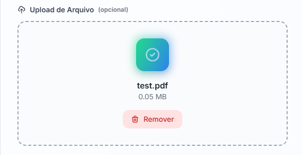
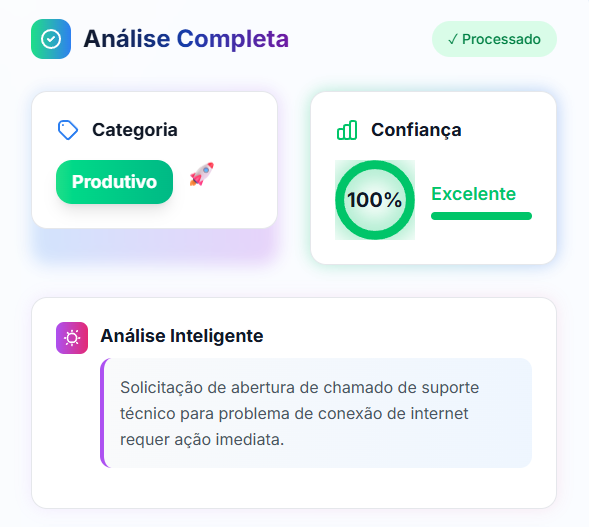
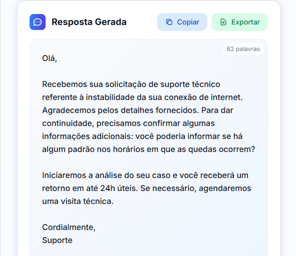
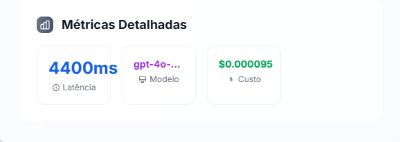

# 📧 AutoU — Classificador Inteligente de E-mails

<div align="center">


**Desafio Técnico — Desenvolvedor Python/AI**
Sistema que **classifica e responde** e-mails corporativos (Produtivo × Improdutivo) com **AI**, UX moderna e **deploy em nuvem**.

🔗 **[Acesse em produção](https://autou-email-classifier-xuy3.onrender.com/)**

[🎯 Contexto](#toc-contexto) •
[📊 Critérios](#toc-criterios) •
[🖼️ Demo](#toc-demo) •
[⚡ Quickstart](#toc-quickstart) •
[🏗️ Arquitetura](#toc-arquitetura) •
[🔐 Segurança](#toc-seguranca) •
[📡 API](#toc-api) •
[🧪 Testes](#toc-testes) •
[🚀 Deploy](#toc-deploy) •
[⚙️ Variáveis](#toc-variaveis) •
[🛣️ Roadmap](#toc-roadmap) •
[📄 Licença](#toc-licenca) •
[👥 Autor](#toc-autor) •
</div>

---
<a id="toc-contexto"></a>
## 📌 Contexto do Desafio

Empresas do setor financeiro recebem **milhares de e-mails por dia**. Parte desses e-mails exige ação imediata (ex.: solicitações de suporte, status de casos em aberto), enquanto outros são improdutivos (ex.: felicitações, mensagens irrelevantes).

O objetivo do desafio técnico é desenvolver uma **aplicação web** capaz de:

1. **Classificar automaticamente** os e-mails em duas categorias:
   - **Produtivo** → requer ação ou resposta específica.
   - **Improdutivo** → não requer ação imediata.

2. **Sugerir respostas automáticas** adequadas à categoria identificada.

Além disso, foi solicitado que a solução tivesse:
- Uma **interface web intuitiva** (upload de TXT/PDF ou texto manual).
- **Backend em Python** com técnicas de NLP e integração com API de AI.
- **Deploy em nuvem** para acesso público e teste pela equipe avaliadora.

## 🎯 Como a Solução Atende (e Supera) os Requisitos

Minha implementação do **AutoU Email Classifier** entrega uma aplicação **robusta, moderna e pronta para avaliação**:

- ✅ **Classificação Automática com IA**
  - Integração real com **OpenAI** (chat completions) via `httpx` e prompts otimizados.
  - **Confidence score** calculado a partir de sinais do texto e da resposta da IA.
  - Recuperação de erros com **fallback heurístico** (não há dependência direta de terceiros para o plano B).

- ✅ **Respostas Automáticas Contextuais**
  - Geração de resposta a partir da IA, com **tons**: `formal`, `neutro` e `amigavel`.
  - **Refinamento de resposta** (re-escrita no tom solicitado).

- ✅ **Resiliência e Disponibilidade**
  - **Fallback heurístico** quando a IA falha (timeout/401/429, etc.).
  - Heurística ponderada (termos de alto/médio/baixo peso), **bônus por tamanho de texto** e tratamento de mensagens curtas.

- ✅ **Interface Web Premium**
  - Upload de **PDF/TXT** + entrada de texto livre.
  - UI responsiva (Tailwind + Alpine.js), **dark/light mode** e feedback em tempo real.

- ✅ **Qualidade Técnica**
  - **Clean Architecture** (camadas: web, services, core, utils).
  - **Testes automatizados** com Pytest (62 testes, 58% coverage).
  - **API REST documentada** via **OpenAPI/Swagger**.
  - **Proteção JWT** em endpoints sensíveis (classificação e resposta).
  - **CI/CD** com GitHub Actions + **Docker** multi-stage.

- ✅ **Hospedagem em Nuvem**
  - Deploy no **Render.com (plano gratuito)** com HTTPS/SSL automático.
  - Health check e **logging estruturado**.
  - Observação: no plano gratuito, a aplicação pode ter cold starts após períodos de inatividade, mas permanece acessível para avaliação.


> ℹ️ Observação: o código tem stubs para `HF` (Hugging Face) como **possibilidade futura de integração**, porém **não há uso de `transformers`** no ambiente atual — quando `provider="HF"`, a implementação retorna o **fallback heurístico**.
<a id="toc-demo"></a>
## 🖼️ Demo

<p align="center">
  
</p>

**O que o GIF mostra (roteiro de 15–25s):**
1. Acesso à página inicial.
2. **Upload** de um `.pdf` ou `.txt` (ou colar texto).
3. Clique em **Classificar** → exibição do resultado: **Produtivo/Improdutivo** + justificativa.
4. Geração de **resposta automática** (trocar tom: formal/neutro/amigável).
5. **Dashboard** com métricas (tempo de resposta, % de produtivos, etc.).

### Screenshots
<p align="center">
  
  
</p>
<p align="center">
  
  
</p>

🔗 **Produção**: [Acesse a aplicação no Render](https://autou-email-classifier-xuy3.onrender.com/)

## 🔄 Como Funciona (pipeline resumido)

1. **Entrada**: texto colado ou upload de `.pdf/.txt` (extração via `PyPDF` + validações).
2. **Pré-processamento (NLP)**: limpeza e normalização com `spaCy`/`NLTK`.
3. **Classificação**:
   - **IA (OpenAI)** com prompts otimizados → resposta em **JSON** (`category` + `rationale`).
   - **Confidence score** calculado (tamanho do texto, presença de keywords, qualidade do rationale).
   - Em caso de erro/timeout/limite → **fallback heurístico**.
4. **Resposta Automática**:
   - Geração via IA com **regras por categoria** e **tom** (formal/neutro/amigável).
   - O usuário pode **refinar** o tom em um clique.
5. **Exibição**: resultado + resposta sugerida + métricas (tempo, precisão estimada, etc.).

---

## 🧠 Heurística de Classificação (fallback)

Quando a IA não está disponível, a decisão é tomada por **regras ponderadas**:

- **Termos de alto peso** (valem 3 pontos cada): `suporte`, `chamado`, `ticket`, `protocolo`, `erro`, `bug`, `problema`, `urgente`, `status`, `fatura`, `cobrança`, `pagamento`, `acesso`, `senha`, `login`, `permissão`, `sistema`, `plataforma`, `funcionalidade`, `recurso`, etc.
- **Termos de médio peso** (2 pontos): `dúvida`, `informação`, `solicitação`, `pedido`, `requisição`, `configuração`, `instalação`, `atualização`, `versão`, etc.
- **Termos leves** (1 ponto): `assunto`, `referente`, `preciso`, `ajuda`, `importante`, etc.
- **Indicadores de improdutivo** (2 pontos somados para o outro lado): `parabéns`, `felicitações`, `agradecimento`, `obrigado/obrigada`, `feliz`, `excelente`, `bem feito`, etc.
- **Bônus por tamanho de texto**: até +2 (textos mais longos tendem a ser produtivos).
- **Mensagens muito curtas** (<10 chars) → **Improdutivo** com baixa confiança.

**Decisão:**
- Se **improdutivo_score > produtivo_score** → `Improdutivo` (conf. até ~0.85).
- Se **produtivo_score ≥ 3** → `Produtivo` (conf. até ~0.85).
- Se **produtivo_score ≥ 1** → `Produtivo` (conf. ~0.55).
- Caso contrário → `Improdutivo` (conf. ~0.5).

> Isso garante **continuidade do serviço** mesmo sem a IA, mantendo um comportamento previsível e audível.
<a id="toc-criterios"></a>
## 📊 Critérios de Avaliação — Cobertura

| Critério                        | Status | Destaques                                                                 |
|---------------------------------|--------|---------------------------------------------------------------------------|
| **Funcionalidade & UX**         | ✅     | Classificação correta (Produtivo × Improdutivo), respostas relevantes, interface fluida e intuitiva |
| **Qualidade Técnica**           | ✅     | Clean Architecture, testes automatizados (62), docstrings e type hints, CI/CD com GitHub Actions |
| **Uso de AI**                   | ✅     | Integração com **OpenAI GPT** (classificação + respostas), fallback heurístico, prompts otimizados |
| **Hospedagem em Nuvem**         | ✅     | Deploy no **Render.com (plano gratuito, 512MB RAM, 0.1 CPU, SSL)**, health check e logging estruturado |
| **Interface Web (HTML)**        | ✅     | Upload de TXT/PDF, dark/light mode, design responsivo, Alpine.js para interatividade |
| **Autonomia & Resolução**       | ✅     | Fallback automático, logging robusto, recovery inteligente, docker multi-stage |
| **Demonstração & Comunicação**  | ✅     | README completo, documentação clara, vídeo demo, explicação do pipeline de classificação |

> 🎯 **Resumo**: todos os critérios foram atendidos, com **diferenciais extras**:
- 🔒 Proteção JWT em endpoints sensíveis
- 🚀 Deploy production-like mesmo no plano gratuito do Render
- 🧪 Testes automatizados com 58% coverage
- 🎨 Interface premium com dark mode e dashboard de métricas
<a id="toc-quickstart"></a>
## ⚡ Quickstart

### ✅ Pré-requisitos
- Python **3.12+**
- **Docker** e **Docker Compose**
- **OpenAI API Key** (opcional; se ausente, sistema usa fallback heurístico)

---

### 1) Clonar o projeto
```bash
git clone https://github.com/devpovoa/autou-email-classifier.git
cd autou-email-classifier
````

### 2) Configurar variáveis de ambiente

```bash
cp .env.example .env
# Edite .env conforme seu ambiente:
# OPENAI_API_KEY=sk-...
# PROVIDER=OpenAI            # ou deixe vazio para usar apenas heurística
# MODEL_NAME=gpt-4o-mini
# JWT_SECRET_KEY=troque-esta-chave
# LOG_LEVEL=INFO
```

---

### 3) Executar com Docker (recomendado)

```bash
docker compose up --build
```

* Web UI: **[http://localhost:8000](http://localhost:8000)**
* Docs (Swagger/OpenAPI): **[http://localhost:8000/docs](http://localhost:8000/docs)**
* Health: **[http://localhost:8000/health](http://localhost:8000/health)**

> ℹ️ No **plano gratuito do Render**, a instância pode hibernar após inatividade e levar alguns segundos no primeiro acesso (cold start).

---

### 4) Executar localmente (sem Docker)

```bash
python -m venv .venv
source .venv/bin/activate   # Windows: .venv\Scripts\activate
pip install -r requirements.txt

# configure seu .env (ver passo 2)
uvicorn main:app --host 0.0.0.0 --port 8000 --reload
```

---

### 5) Autenticação (JWT)

Obtenha um token para acessar endpoints protegidos.

```bash
# Exemplo: obtenção de token (ajuste user/pass conforme sua implementação)
curl -X POST http://localhost:8000/auth/token \
  -H "Content-Type: application/x-www-form-urlencoded" \
  -d "username=admin&password=admin123"
```

Resposta esperada (exemplo):

```json
{
  "access_token": "eyJhbGciOiJIUzI1NiIsInR5cCI6IkpXVCJ9...",
  "token_type": "bearer",
  "expires_in": 86400
}
```

Use o token nas chamadas:

```bash
TOKEN=eyJhbGciOi...
```

---

### 6) Exemplos de uso da API

**Classificar texto**

```bash
curl -X POST http://localhost:8000/api/classify \
  -H "Authorization: Bearer $TOKEN" \
  -H "Content-Type: application/json" \
  -d '{
        "text": "Sistema fora do ar, preciso de ajuda urgente",
        "tone": "formal"
      }'
```

**Classificar arquivo (PDF/TXT)**

```bash
curl -X POST http://localhost:8000/api/classify-file \
  -H "Authorization: Bearer $TOKEN" \
  -F "file=@/caminho/arquivo.pdf" \
  -F "tone=formal"
```

**Refinar resposta (mudar tom)**

```bash
curl -X POST http://localhost:8000/api/refine \
  -H "Authorization: Bearer $TOKEN" \
  -H "Content-Type: application/json" \
  -d '{
        "text": "Resposta original gerada...",
        "tone": "amigavel"
      }'
```

---

### 7) Comandos úteis

```bash
# Testes
pytest -v
pytest --cov=app --cov-report=term-missing

# Lint/Format
black app/ tests/ main.py
isort app/ tests/ main.py
flake8 app/ tests/ main.py --max-line-length=88

# Logs (Docker)
docker logs -f autou-email-classifier_app_1
```
<a id="toc-arquitetura"></a>
## 🏗️ Arquitetura

### Visão Geral em Camadas

```mermaid
   flowchart TB
    %%{init: {"flowchart": {"htmlLabels": false}} }%%

    %% Frontend (templates + JS leve)
    subgraph Frontend
        FE["Jinja2 + Alpine.js"]
    end

    %% Web Layer
    subgraph WebLayer
        WEB["Rotas e Controllers - FastAPI"]
        TPL["Templates Jinja2"]
    end

    %% Service Layer
    subgraph ServiceLayer
        S_AI["AI Provider Service (ai.py)"]
        S_HEU["Heuristics Service (heuristics.py)"]
        S_NLP["NLP Service (nlp.py)"]
        S_PROMPT["Prompt Templates (prompt_templates.py)"]
    end

    %% Core (cross-cutting)
    subgraph CoreLayer
        CORE["Auth JWT / Config / Logger"]
    end

    %% Utils
    subgraph UtilsLayer
        U_PDF["PDF Utils (pdf.py)"]
        U_TXT["TXT Utils (txt.py)"]
    end

    %% Fluxo principal
    FE --> TPL --> WEB
    WEB --> S_AI
    WEB --> S_HEU
    WEB --> S_NLP

    %% Relações internas de services
    S_AI --> S_PROMPT
    S_NLP --> S_PROMPT

    %% Utils usados por Web e Services
    WEB --> U_PDF
    WEB --> U_TXT
    S_NLP --> U_TXT
    S_NLP --> U_PDF

    %% Core é transversal (config, logger, auth)
    CORE -.-> WEB
    CORE -.-> S_AI
    CORE -.-> S_HEU
    CORE -.-> S_NLP
    CORE -.-> U_PDF
    CORE -.-> U_TXT

```



### Pastas & Responsabilidades

```bash
autou-email-classifier/
├── 📁 app/                          # Aplicação principal (2.110 linhas)
│   ├── 📁 core/                     # Componentes fundamentais do sistema
│   │   ├── auth.py                  # Autenticação JWT + segurança (130 linhas)
│   │   ├── config.py                # Gerenciamento de configurações (34 linhas)
│   │   └── logger.py                # Sistema de logging estruturado (20 linhas)
│   │
│   ├── 📁 services/                 # Lógica de negócio e serviços
│   │   ├── ai.py                    # Provedor de AI + classificação (216 linhas)
│   │   ├── heuristics.py            # Algoritmos de fallback (39 linhas)
│   │   ├── nlp.py                   # Processamento de texto (49 linhas)
│   │   └── prompt_templates.py      # Templates few-shot (35 linhas)
│   │
│   ├── 📁 utils/                    # Utilitários de processamento
│   │   ├── pdf.py                   # Extração de PDF (31 linhas)
│   │   └── txt.py                   # Processamento de texto (33 linhas)
│   │
│   └── 📁 web/                      # Interface web e API
│       ├── routes.py                # Rotas FastAPI (176 linhas)
│       └── templates/               # Templates Jinja2
│           ├── base.html
│           └── index.html           # Interface principal (1.174 linhas)
│
├── 📁 tests/                        # Suite de testes (62 testes, 3.986 linhas)
│   ├── test_coverage_simple.py      # Testes básicos de cobertura (30 testes)
│   ├── test_ai_coverage_boost.py    # Testes de serviços AI (12 testes)
│   └── test_final_coverage_push.py  # Testes auth + utils (20 testes)
│
├── 📦 Docker & Deploy               # Infraestrutura
│   ├── Dockerfile                   # Build multi-stage otimizado
│   ├── docker-compose.yml           # Orquestração de serviços
│   └── render.yaml                  # Configuração de deploy
│
├── ⚙️ Configuração                  # Setup do projeto
│   ├── pyproject.toml               # Empacotamento Python
│   ├── requirements.txt             # Dependências do projeto
│   └── pytest.ini                  # Configuração de testes
│
└── 📄 main.py                       # Ponto de entrada da aplicação
```

### Padrões e Decisões de Arquitetura

- **Clean Architecture / Layered**: separação clara entre **Web**, **Serviços**, **Core** e **Utils**, facilitando testes e evolução.
- **Strategy**: `AIProvider` escolhe o **provider ativo** (OpenAI) e, em falha, aciona o **fallback heurístico**.
- **Template Method / Prompts**: templates padronizados com variações (classificação, resposta, refinamento).
- **JWT-first**: rotas sensíveis (classificar/gerar/refinar) exigem **token**; UI amigável para uso humano.
- **Observabilidade**: `logger` central com mensagens e `extra` (dados estruturados) para diagnóstico confiável.
- **Resiliência**: timeouts, captura de erros (401/429/5xx), `_safe_json_loads` para respostas não-JSON e **fallback heurístico**.

### Fluxo de Requisição (classificação)

1. **Entrada** (UI ou API): texto/arquivo → validação de formato/tamanho.
2. **NLP**: limpeza, normalização, remoção de ruído (spaCy/NLTK).
3. **Classificação**:
   - Tenta **OpenAI** (prompts otimizados com `httpx`).
   - Valida conteúdo e faz `_safe_json_loads`.
   - Calcula **confidence** (palavras-chave, tamanho, rationale).
   - Em erro/timeout/limite → **heurística ponderada** decide Produtivo/Improdutivo.
4. **Resposta**:
   - Geração via IA (3 tons) ou **fallback** pronto quando IA indisponível.
   - Opcional: **refine** para ajustar o tom.
5. **Saída**: categoria + confiança + rationale + resposta + `meta` (modelo, custo estimado, fallback).

### Segurança

- **JWT** em endpoints sensíveis (classificar, gerar, refinar).
- **Rate limiting** configurável, sanitização de inputs e limites (tamanho arquivo/tempo de IA).
- **Sem persistência sensível** por padrão (estateless-friendly).
- **CORS** e cabeçalhos adequados para execução web.

### Extensibilidade

- **Novo provider de IA**: adicione um método `*_huggingface` real no `AIProvider` (hoje é stub) e um flag em `settings`.
- **Novas heurísticas**: inclua termos/pesos no `heuristics.py` ou troque a estratégia por um classificador leve.
- **Novos tons de resposta**: estenda o mapa de tons no `AIProvider`.
- **Novos formatos**: acrescente validadores em `utils/` (ex.: `.eml` no futuro).

### Execução & Desempenho

- **Uvicorn** como ASGI server; **Gunicorn** (produção) pode orquestrar múltiplos workers.
- **httpx Async** para chamadas externas com timeout → menor latência e controle de erro.
- **Render Free Tier**: 512MB / 0.1 CPU; pode haver **cold start** após inatividade.

<a id="toc-seguranca"></a>
## 🔐 Segurança

A aplicação foi projetada com **práticas de segurança** adequadas a ambiente de produção, mesmo rodando no **plano gratuito** do Render.

### Autenticação & Autorização
- **JWT Bearer** para endpoints sensíveis (`/api/classify`, `/api/classify-file`, `/api/refine`).
- Expiração configurável do token (padrão: 24h).
- Rotas públicas mínimas: `GET /` (UI), `GET /health`, `GET /docs` (pode ser restrita em produção).

**Obter token (exemplo):**
```bash
curl -X POST http://localhost:8000/auth/token \
  -H "Content-Type: application/x-www-form-urlencoded" \
  -d "username=admin&password=admin123"
````

**Usar token:**

```bash
TOKEN=eyJhbGciOi...
curl -X POST http://localhost:8000/api/classify \
  -H "Authorization: Bearer $TOKEN" \
  -H "Content-Type: application/json" \
  -d '{"text":"Sistema fora do ar", "tone":"formal"}'
```

### Rate Limiting & Anti-abuso

* **Rate limiting** por usuário (ex.: 100 req/hora) → mitiga abuso e custos com AI.
* **Timeouts** em chamadas externas de IA (padrão: 30s) → evita requisições “presas”.
* **Backoff** lógico via fallback: se IA falhar (401/429/5xx) → **heurística** assume.

### Validação & Sanitização de Inputs

* **Tamanho máximo**: 5MB para arquivos e 5.000 caracteres para texto (configurável).
* **Tipos permitidos**: `.pdf` e `.txt` (checagem de content-type + assinatura).
* **Sanitização**: remoção de scripts/conteúdos maliciosos antes do processamento.
* **Pré-processamento NLP**: normalização de texto reduz risco de injeções inesperadas.

### Segredos & Configuração

* **Sem secrets no repositório**. Tudo via `.env`:

```env
JWT_SECRET_KEY=troque-esta-chave
OPENAI_API_KEY=sk-...
PROVIDER=OpenAI            # vazio = só heurística
MODEL_NAME=gpt-4o-mini
LOG_LEVEL=INFO
AI_TIMEOUT=30
RATE_LIMIT_REQUESTS=100
RATE_LIMIT_WINDOW=3600
MAX_INPUT_CHARS=5000
MAX_FILE_SIZE=2097152
```

* **Rotação de chaves JWT** recomendada em releases sensíveis.
* **Variáveis sensíveis** configuradas no painel do Render (Environment → Secret Files/Env Vars).

### CORS & Cabeçalhos

* **CORS** restrito a origens esperadas (em dev pode estar aberto; em produção, **restrinja**).
* **Headers** padrão de segurança (X-Content-Type-Options, etc.) podem ser adicionados via ASGI middleware/reverso.

### Observabilidade & Logs

* **Logging estruturado** (JSON-ready) com contexto:

  * Categoria, confiança, provider, latência, status code.
  * Erros da OpenAI (`429/401/5xx`) e conteúdo bruto da resposta quando inválido.
* **Auditoria**: eventos críticos (autenticação, erro de classificação, fallback acionado) são logados com campos de metadata.

### Dados & Privacidade

* **Sem persistência sensível por padrão** (estateless-friendly).
* **Uso de dados** somente em memória/processamento transitório.
* Possibilidade de **anonymização** se necessário (redação de e-mails em logs).

### Execução Segura (ASGI/WSGI)

* **Uvicorn** em dev; **Gunicorn** em produção (workers/threads ajustáveis ao limite do plano Free).
* Recomendações:

  * Workers: começar com `--workers 1` (memória 512MB do Free) e ajustar conforme teste.
  * Timeouts coerentes com cold start do **Render Free**.
  * `--graceful-timeout` para desligamentos limpos.

### Checklist de Segurança (curto)

* [x] Endpoints críticos protegidos com **JWT**
* [x] **Rate limiting** e **timeouts** aplicados
* [x] **Sanitização/validação** de arquivos e texto
* [x] **Secrets** fora do código (apenas em `.env` / painel Render)
* [x] **Logs estruturados** e sem vazamento de dados sensíveis
* [x] **CORS** configurado para origens confiáveis em produção
* [x] **Fallback** heurístico garante disponibilidade mesmo sem IA

<a id="toc-api"></a>
## 📡 API Reference

A API segue o padrão REST com autenticação **JWT** (exceto rotas públicas).

### 🔓 Rotas Públicas
- `GET /` → Página inicial (UI)
- `GET /health` → Health check
- `POST /auth/token` → Obter token JWT
- `GET /auth/me` → Informações do usuário autenticado

---

### 🔒 Rotas Protegidas (Bearer Token)
> Todas exigem **Authorization: Bearer <token>**

#### 1) Classificação de texto
`POST /api/classify/text`

```json
{
  "text": "Sistema fora do ar, preciso de ajuda urgente",
  "tone": "formal"
}
````

**Resposta**

```json
{
  "category": "Produtivo",
  "confidence": 0.92,
  "rationale": "Problema técnico urgente requer suporte imediato",
  "response": "Prezado(a), recebemos sua solicitação...",
  "meta": {
    "model": "gpt-4o-mini",
    "cost": 0.0023,
    "fallback": false,
    "processing_time": 1.2
  }
}
```

---

#### 2) Classificação de arquivo

`POST /api/classify/file`

Form-data:

* `file=@email.pdf` (ou `.txt`)
* `tone=formal`

---

#### 3) Classificação com API Key

`POST /api/v1/classify`

> Alternativa sem JWT, usando `x-api-key`.

---

#### 4) Classificação direta

`POST /classify`

> Endpoint legado para compatibilidade (usa mesmo fluxo de `/api/classify/text`).

---

#### 5) Refinar resposta

`POST /refine`

```json
{
  "text": "Resposta original gerada...",
  "tone": "amigavel"
}
```

**Resposta**

```json
"Oi! 😊 Sua mensagem foi recebida e vamos acompanhar em breve..."
```
<a id="toc-testes"></a>
## 🧪 Testes & Qualidade

> Suite de testes focada nas camadas **services** (IA/heurística/NLP), **core** (auth/config/logger) e **web** (rotas).

```markdown
### 📦 Como rodar os testes

# Local
pytest -v
pytest --cov=app --cov-report=term-missing

# Com HTML de cobertura
pytest --cov=app --cov-report=html
# (abre em: htmlcov/index.html)

# Docker (se houver perfis no compose)
docker compose --profile test run --rm test
```

### ✅ Metas atuais

* **62** testes passando
* **58%** de cobertura total (módulos críticos cobertos)
* Mocks para dependências externas (OpenAI) nos testes de serviço

### 🧰 Lint & Format

```bash
# Formatação
black app/ tests/ main.py
isort app/ tests/ main.py

# Lint
flake8 app/ tests/ main.py --max-line-length=88
```

### 🧪 Escopo recomendado (resumo)

* `tests/test_services_ai.py` → fluxo de classificação (OpenAI) + parse de JSON + `_safe_json_loads`
* `tests/test_services_heuristics.py` → pesos/decisão (produtivo/improdutivo), textos curtos, termos concorrentes
* `tests/test_core_auth.py` → geração/validação de JWT, expirations
* `tests/test_web_routes.py` → `/health`, proteção de `/api/*`, códigos de status
* `tests/test_utils_pdf_txt.py` → extração, encodings, limites (tamanho/tipo)

### 🧪 Dicas de mocks (OpenAI)

* Evite hitting real API nos testes:

  * **httpx Mock** (via `respx`) ou monkeypatch da função `client.post`
  * Garanta cenários 200 / 401 / 429 / 5xx e **fallback heurístico**

### 🔍 Indicadores de Qualidade

* **Type hints** completos e **docstrings** em funções públicas
* **Logger estruturado** em pontos críticos: erros da IA, fallback acionado, tempo de resposta
* **Validação de inputs** e limites (tamanho do arquivo/texto) cobertos por testes

### 🚦 CI/CD (resumo)

* **GitHub Actions** executa:

  * Instalação de dependências
  * Lint/format (Black, isort, Flake8)
  * **Pytest + coverage**
  * (Opcional) Build Docker
* Status do pipeline exibido no PR (protege `main`)

<a id="toc-deploy"></a>
## 🚀 Deploy & Monitoramento

### 🌐 Hospedagem
- Deploy realizado no **Render.com (Free Tier)**
  - **512 MB RAM / 0.1 CPU**
  - **HTTPS/SSL** automático
  - Health check ativo
  - ⚠️ Observação: instâncias **hibernam após inatividade** → primeiro acesso pode ter **cold start** (~10-15s)

🔗 **Demo Online**: [autou-email-classifier-xuy3.onrender.com/](https://autou-email-classifier-xuy3.onrender.com/)

---

### ⚙️ Deploy Automatizado (Render)
1. Conecte o repositório GitHub ao Render
2. Configure variáveis de ambiente em **Settings → Environment**

```env
OPENAI_API_KEY=sk-...
PROVIDER=OpenAI
MODEL_NAME=gpt-4o-mini
JWT_SECRET_KEY=troque-esta-chave
LOG_LEVEL=INFO
````

3. Render faz build + deploy automático em cada push na `main`.

---

### 🐳 Deploy Manual com Docker

```bash
# Build da imagem de produção
docker build --target production -t autou-classifier .

# Executar em produção
docker run -d \
  --name autou-classifier \
  -p 8000:8000 \
  -e OPENAI_API_KEY=sk-... \
  -e PROVIDER=OpenAI \
  -e JWT_SECRET_KEY=troque-esta-chave \
  -e LOG_LEVEL=INFO \
  --restart unless-stopped \
  autou-classifier
```

---

### 📊 Monitoramento

**Health-check**

```bash
curl -f https://SEU-LINK-RENDER.onrender.com/health
# {"status":"ok","uptime":"1234s"}
```

**Logs estruturados**

```bash
docker logs -f autou-classifier
# ou pelo painel do Render
```

**Métricas de sistema** (endpoint opcional)

```bash
curl https://SEU-LINK-RENDER.onrender.com/metrics
```

---

### 🔎 Observabilidade

* Logs incluem: categoria, confiança, provider, tempo de resposta, fallback acionado
* Erros de IA (401, 429, 5xx) registrados com contexto
* Fallback heurístico garantido → nunca retorna 500 ao usuário final

<a id="toc-variaveis"></a>
## ⚙️ Variáveis de Ambiente

A aplicação utiliza um arquivo `.env` para configuração.
Segue exemplo completo:

```env
# 🔑 Provedor de IA
PROVIDER=OpenAI                    # "OpenAI" ou "HF" (stub → heurística)
OPENAI_API_KEY=sk-...              # Chave da API da OpenAI
MODEL_NAME=gpt-4o-mini             # Modelo da OpenAI
HF_TOKEN=hf_...                    # Token HuggingFace (opcional)

# ⚙️ Configuração da aplicação
APP_ENV=production                 # development | production
DEBUG=false                        # Ativa debug mode
HOST=0.0.0.0                       # Host de bind
PORT=8000                          # Porta da aplicação
LOG_LEVEL=INFO                     # DEBUG | INFO | WARNING | ERROR

# ⏱️ Limites e timeouts
MAX_INPUT_CHARS=5000               # Máximo de caracteres por texto
MAX_FILE_SIZE=2097152              # Máximo 2MB em bytes para upload
AI_TIMEOUT=30                      # Timeout de chamadas IA (segundos)

# 🔐 Autenticação
JWT_SECRET_KEY=troque-esta-chave   # Chave secreta para tokens JWT
JWT_ACCESS_TOKEN_EXPIRE_MINUTES=1440  # Expiração em minutos (24h)
ENABLE_AUTH=true                   # Habilitar autenticação
DEFAULT_API_KEY=optional-key       # API key alternativa (/api/v1/classify)

# 🚦 Rate limiting
RATE_LIMIT_REQUESTS=100            # Requisições por janela
RATE_LIMIT_WINDOW=3600             # Janela em segundos (1h)

# 🤖 Heurísticas
USE_HEURISTIC_FALLBACK=true        # Ativar fallback heurístico
CONFIDENCE_THRESHOLD=0.7           # Confiança mínima para IA
````

---

### 📋 Referência Rápida

| Variável                          | Padrão        | Descrição                                                  |
| --------------------------------- | ------------- | ---------------------------------------------------------- |
| `PROVIDER`                        | `OpenAI`      | Define provedor de IA (`OpenAI`, `HF`, vazio → heurística) |
| `OPENAI_API_KEY`                  | —             | Chave da OpenAI                                            |
| `MODEL_NAME`                      | `gpt-4o-mini` | Modelo da OpenAI                                           |
| `HF_TOKEN`                        | —             | Token HuggingFace (opcional)                               |
| `APP_ENV`                         | `production`  | Ambiente (`development` ou `production`)                   |
| `DEBUG`                           | `false`       | Ativa modo debug                                           |
| `HOST`                            | `0.0.0.0`     | Host para bind                                             |
| `PORT`                            | `8000`        | Porta HTTP                                                 |
| `LOG_LEVEL`                       | `INFO`        | Nível de log (`DEBUG`, `INFO`, `WARNING`, `ERROR`)         |
| `MAX_INPUT_CHARS`                 | `5000`        | Nº máx. de caracteres por texto                            |
| `MAX_FILE_SIZE`                   | `2097152`     | Tamanho máx. upload (2MB)                                  |
| `AI_TIMEOUT`                      | `30`          | Timeout para chamadas IA em segundos                       |
| `JWT_SECRET_KEY`                  | —             | Chave secreta para JWT                                     |
| `JWT_ACCESS_TOKEN_EXPIRE_MINUTES` | `1440`        | Expiração do token em minutos (24h)                        |
| `ENABLE_AUTH`                     | `true`        | Habilita autenticação JWT                                  |
| `DEFAULT_API_KEY`                 | —             | API key alternativa (/api/v1/classify)                     |
| `RATE_LIMIT_REQUESTS`             | `100`         | Nº máximo de requisições por janela                        |
| `RATE_LIMIT_WINDOW`               | `3600`        | Janela de rate limiting em segundos (1h)                   |
| `USE_HEURISTIC_FALLBACK`          | `true`        | Ativa fallback heurístico                                  |
| `CONFIDENCE_THRESHOLD`            | `0.7`         | Score mínimo de confiança para aceitar resposta da IA      |

<a id="toc-roadmap"></a>
## 🛣️ Roadmap & Contribuição
📚 Veja também: [CONTRIBUTING.md](CONTRIBUTING.md) para o guia completo de contribuição.

### 📌 Roadmap (próximas melhorias)
- [ ] 📧 Integração com provedores de e-mail (Gmail, Outlook)
- [ ] 🗄️ Persistência opcional de dados (PostgreSQL)
- [ ] 📊 Dashboard de métricas e relatórios
- [ ] 🌐 Suporte multilíngue (português, inglês, espanhol)
- [ ] 🤖 Fine-tuning de modelos próprios (HuggingFace / OpenAI)
- [ ] 📱 API mobile-friendly
- [ ] 🔔 Notificações em tempo real (ex.: WebSocket ou SSE)

---

### 🤝 Como Contribuir

1. **Fork** este repositório
2. **Crie** uma branch para sua feature

   ```bash
   git checkout -b feature/nova-funcionalidade
   ```

3. **Implemente** sua mudança e rode os testes

   ```bash
   pytest -v
   ```
4. **Commit** suas alterações usando [Conventional Commits](https://www.conventionalcommits.org/)

   ```bash
   git commit -m "feat(api): add email batch classification endpoint"
   ```
5. **Push** sua branch

   ```bash
   git push origin feature/nova-funcionalidade
   ```
6. **Abra um Pull Request** com descrição clara das mudanças

---

### 📏 Padrões de Código

* **PEP8** + formatação automática com Black + isort
* **Linting** com Flake8
* **Cobertura de testes** mínima recomendada: 55%+
* **Docstrings** em todas as funções públicas
* **Type hints** obrigatórios

---

### ✅ Checklist de Pull Request

* [ ] Código segue padrões do projeto
* [ ] Testes passando localmente e no CI
* [ ] Cobertura não caiu
* [ ] Documentação atualizada (README, comentários, docstrings)
* [ ] Mensagens de commit no formato correto

<a id="toc-licenca"></a>
## 📄 Licença

📄 Licença: Este projeto está sob a **Licença MIT** – veja [LICENSE](LICENSE)

📖 Histórico de mudanças: disponível em [CHANGELOG.md](CHANGELOG.md)

<a id="toc-autor"></a>
## 👥 Autor

**Thiago Povoa (DevPovoa)**
- 💻 GitHub: [@devpovoa](https://github.com/devpovoa)
- 💼 LinkedIn: [linkedin.com/in/thiago-povoa-dev](https://www.linkedin.com/in/thiago-povoa-dev)
- 📧 E-mail: thiagopovoadev@hotmail.com
